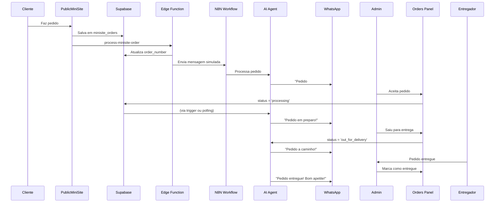

# Sistema de Agentes de Delivery - Documentação

## 📋 Visão Geral

Sistema completo para gerenciamento automático de pedidos de delivery via WhatsApp usando agentes de IA especializados.

## 🏗️ Arquitetura

### 1. **Workflow Base de Delivery** (`workflow_delivery_base.json`)

Template especializado para delivery com os seguintes componentes:

#### Nós Principais:
- **Webhook**: Recebe mensagens do WhatsApp (pedidos e atualizações de status)
- **Extract Data**: Extrai dados do cliente, mensagem e número do pedido
- **Get Order**: Busca o pedido no banco usando `order_number`
- **AI Agent**: Processa a mensagem e decide ações
- **OpenAI Chat Model**: Modelo de linguagem para respostas inteligentes
- **Update Order Status**: Atualiza status do pedido no banco
- **Send WhatsApp Response**: Envia resposta ao cliente

#### Fluxo de Trabalho:
```
WhatsApp → Webhook → Extract Data → Get Order → AI Agent → Send Response
                                         ↓
                                   Update Status
```

### 2. **Gerador de Workflow** (`deliveryWorkflowGenerator.ts`)

Serviço que cria workflows personalizados para cada mini site:

```typescript
DeliveryWorkflowGenerator.generate({
  miniSiteId: '...',
  miniSiteName: 'Pastelaria do Zé',
  instanceName: 'instance_123',
  webhookUrl: 'https://webhook.auroratech.tech/webhook'
})
```

**Funcionalidades:**
- Gera IDs únicos para cada workflow
- Configura filtros por `mini_site_id`
- Injeta nome do estabelecimento no prompt
- Cria webhook exclusivo

### 3. **Edge Function** (`create-delivery-agent`)

Automatiza a criação de agentes de delivery:

```typescript
POST /functions/v1/create-delivery-agent
{
  "miniSiteId": "uuid",
  "miniSiteName": "Nome do Estabelecimento",
  "userId": "uuid",
  "instanceName": "instance_name"
}
```

**O que faz:**
1. Cria registro na tabela `agents` (tipo: delivery)
2. Gera workflow no n8n
3. Vincula agente ao mini site
4. Configura webhook automático

## 🤖 Comportamento do Agente de Delivery

### System Prompt Especializado:

```
Você é o assistente virtual de delivery do [Nome do Estabelecimento].

PEDIDO ATUAL:
- Número: #12345678
- Cliente: João Silva
- Status: pending/processing/out_for_delivery/delivered/completed/cancelled
- Total: R$ 45.00
- Itens: [lista de itens]

SUA FUNÇÃO:
1. Confirmar pedidos recebidos
2. Informar status de preparação
3. Avisar quando o pedido sair para entrega
4. Confirmar entrega
5. Responder dúvidas sobre o pedido
```

### Respostas Automáticas por Status:

| Status | Mensagem Automática |
|--------|-------------------|
| `pending` | "Recebemos seu pedido #XX no valor de R$ YY. Estamos verificando..." ⏳ |
| `processing` | "Seu pedido #XX foi aceito e está sendo preparado!" 👨‍🍳 |
| `out_for_delivery` | "Seu pedido #XX saiu para entrega! O entregador está a caminho." 🛵 |
| `delivered` | "Pedido #XX entregue! Bom apetite!" 😋 |
| `completed` | "Obrigado por escolher [Nome]! Esperamos você novamente." ❤️ |
| `cancelled` | "Infelizmente seu pedido #XX foi cancelado." 😔 |

### Tools Disponíveis:

1. **Atualizar Status do Pedido**
   - Muda status no banco
   - Envia notificação automática ao cliente

2. **Buscar Informações do Pedido**
   - Consulta detalhes completos
   - Histórico de mudanças de status

## 🔄 Integração com o Sistema Atual

### Workflow Padrão vs Delivery

| Característica | Workflow Padrão | Workflow Delivery |
|---------------|----------------|-------------------|
| **Propósito** | Atendimento geral, agendamentos | Gestão de pedidos |
| **Contexto** | Variável (IPTV, consultas, etc) | Pedidos de delivery |
| **Tools** | Calendário, busca de info | Status de pedidos |
| **Dados** | Cliente genérico | Pedido + Cliente |
| **Notificações** | Sob demanda | Automáticas por status |

### Como Usar os Dois:

**Opção 1: Agente Dedicado (Recomendado)**
- Crie uma instância Evolution separada para delivery
- Use `create-delivery-agent` para criar agente automático
- Melhor separação de contextos

**Opção 2: Agente Híbrido**
- Use o workflow padrão com adaptações
- Adicione tools de pedidos ao workflow existente
- Mais econômico mas menos especializado

## 📊 Fluxo Completo de Pedido



## 🚀 Implementação

### Passo 1: Criar Mini Site

```typescript
// No MiniSite.tsx ou via API
const miniSite = await supabase
  .from('mini_sites')
  .insert({
    name: 'Pastelaria do Zé',
    slug: 'pastel-do-ze',
    whatsapp_number: '5512981493220',
    // ... outros campos
  })
  .select()
  .single();
```

### Passo 2: Criar Agente de Delivery

```typescript
// Automaticamente via botão no painel OU manualmente:
const response = await fetch(
  `${supabaseUrl}/functions/v1/create-delivery-agent`,
  {
    method: 'POST',
    headers: {
      'Authorization': `Bearer ${token}`,
      'Content-Type': 'application/json'
    },
    body: JSON.stringify({
      miniSiteId: miniSite.id,
      miniSiteName: miniSite.name,
      userId: user.id,
      instanceName: 'instance_delivery_pastel'
    })
  }
);
```

### Passo 3: Fazer Deploy do Workflow

A Edge Function `create-delivery-agent` automaticamente:
1. Cria o agente no banco
2. Chama `n8n-import-workflow` com `workflowType: 'delivery'`
3. Vincula agent_id ao mini_site

### Passo 4: Testar

1. Faça um pedido no mini site público
2. Verifique se o pedido aparece na tabela `minisite_orders` com `order_number`
3. Verifique logs da Edge Function `process-minisite-order`
4. Verifique se o cliente recebeu mensagem de confirmação

## 🛠️ Customização

### Personalizar Prompt do Agente:

Edite o system prompt em `create-delivery-agent/index.ts`:

```typescript
system_prompt: `Você é o assistente virtual de delivery do ${miniSiteName}.

[Seu prompt personalizado aqui]

Instruções específicas do negócio:
- Horário de funcionamento: 11h às 23h
- Tempo médio de preparo: 30min
- Taxa de entrega: R$ 5,00
etc...`
```

### Adicionar Novas Tools:

No `workflow_delivery_base.json`, adicione novos nós de ferramentas:

```json
{
  "parameters": {
    "name": "Calcular Tempo de Entrega",
    "description": "Estima tempo baseado no bairro",
    // ... configuração
  },
  "type": "n8n-nodes-base.code",
  "name": "Calculate Delivery Time"
}
```

## 📈 Melhorias Futuras

- [ ] Notificações automáticas de mudança de status (webhook trigger)
- [ ] Estimativa de tempo de entrega por bairro
- [ ] Integração com tracking GPS do entregador
- [ ] Histórico de conversas no painel admin
- [ ] Dashboard de métricas de delivery (tempo médio, satisfação, etc)
- [ ] Sistema de avaliação pós-entrega
- [ ] Integração com impressoras de pedidos
- [ ] Suporte a múltiplos idiomas

## 🐛 Troubleshooting

### Pedido não gera mensagem no WhatsApp

1. Verificar se `agent_id` está configurado no mini_site
2. Verificar se workflow está ativo no n8n
3. Verificar logs em `Supabase → Edge Functions → process-minisite-order`
4. Verificar webhook URL do agente

### Order number não está sendo salvo

1. Verificar se migration `20251118_add_order_number.sql` foi aplicada
2. Verificar logs da Edge Function (deve mostrar "✅ Order number salvo")
3. Verificar se `orderId` está sendo enviado no payload

### AI Agent não responde

1. Verificar credenciais OpenAI no n8n
2. Verificar se o workflow tem conexão com o Chat Model
3. Verificar logs do n8n
4. Testar manualmente no n8n editor

## 📚 Referências

- **Workflow Base**: `src/assets/workflow_base.json` (padrão)
- **Workflow Delivery**: `src/assets/workflow_delivery_base.json`
- **Generator**: `src/services/deliveryWorkflowGenerator.ts`
- **Edge Function**: `supabase/functions/create-delivery-agent/`
- **Process Orders**: `supabase/functions/process-minisite-order/`
- **Orders Panel**: `src/pages/Orders.tsx`
- **Public Mini Site**: `src/pages/PublicMiniSite.tsx`

---

**Desenvolvido para WhatsApp AI Platform - Aurora Tech**
